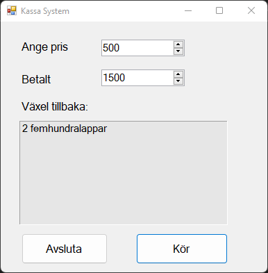
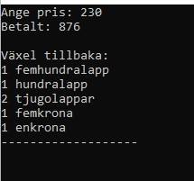
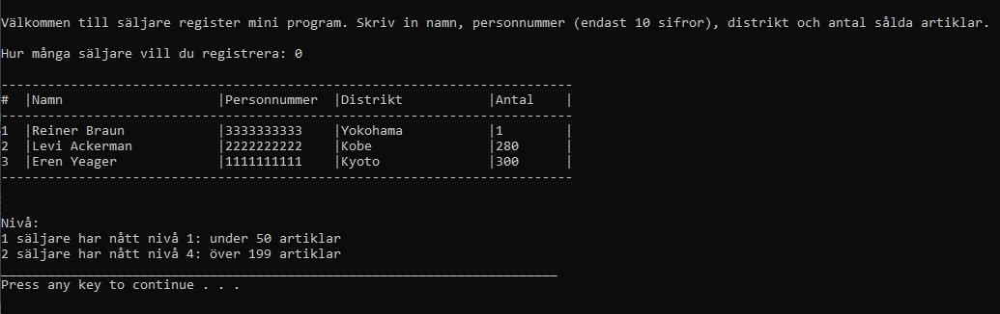
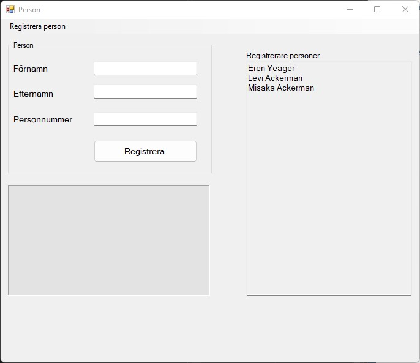

# Programming with C#

This repository contains programs implemented in C#.

## ChangeMoney

The program calculates how much change you should get back when you have shopped, the program shows how much and in which banknotes (500-, 200-, 100-, 50-, 20-lappar) and coins (10-, 5-, 1- kronor) the customer gets his change. 

## RegisterSeller

The program reads data for a number of sellers in a salesforce, the user can enter how many sellers he/she wants to register and enter the seller's data (name, personnumber, which district he/she works in and how many items he/she has sold during the period). The data will be written to a file. There are levels that the seller can achieve depending on the number of items he/she has sold. There are the following four levels:

- level 1: under 50 items
- level 2: 50-99 items
- level 3: 100-199 items
- level 4: over 199 items

## PersonRegistration

Windows forms application for registering people. The user enters the person's first name, last name and personnumber, a validator will go through the data and check if the person is already registered. If everything goes through, the person will be registered. Persons who are registered are shown on the form (under Registrerade personer). The persons data will be written to a file and will be read from there.

