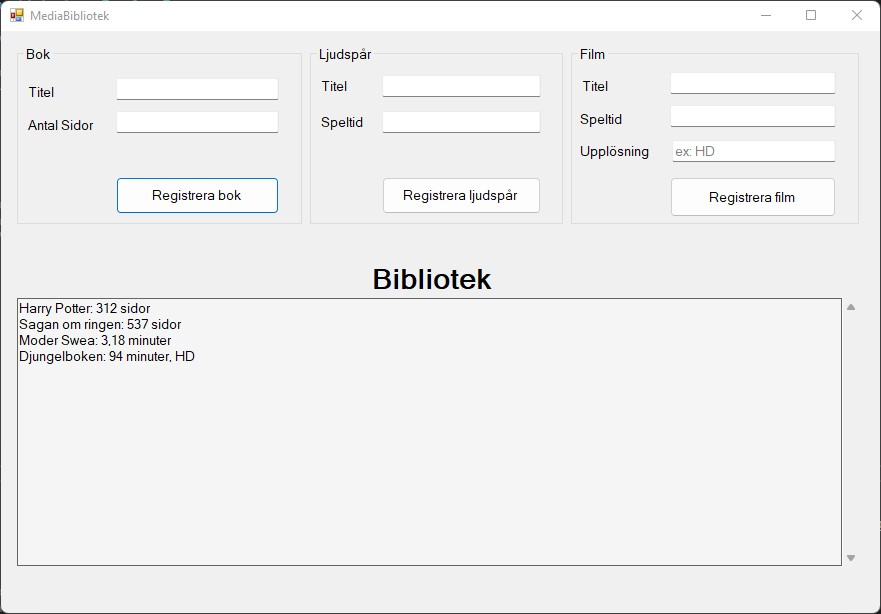

# Programming with C#

This repository contains simple programs that have been implemented in C#.

## Register Seller 

This console application reads data for a specified number of sellers in a Salesforce. The user is prompted to enter the number of sellers to register, as well as each seller's name, personnumber, district of work, and number of items sold during the relevant period. The data is then written to a file, which the program can later read. The sellers are classified into four levels based on the number of items they have sold during the period.

- level 1: under 50 items
- level 2: 50-99 items
- level 3: 100-199 items
- level 4: over 199 items

## Change Money

This Windows Forms and console application calculates the amount of change that a customer should receive after a shopping transaction. The program displays the amount of change, as well as the specific denominations of banknotes (500-, 200-, 100-, 50-, and 20- kronor) and coins (10-, 5-, and 1- kronor) that the customer should receive.

## Person Registration

This Windows Forms application is used for registering individuals. The user inputs the person's first name, last name, and personnumber. A validator checks the entered data to ensure that the person is not already registered. If the data passes validation, the person is successfully registered. Registered persons are displayed on the form under the ***Registrerade personer*** section. The person's data is also saved to a file, which the program can later read.

## MediaLibrary 

This program is designed to register a collection of media items, including books (with title and page numbers), soundtracks (with title and playing time), and movies (with title, playing time, and resolution). The program is capable of storing media data in a file as well as retrieving media data from that file.

