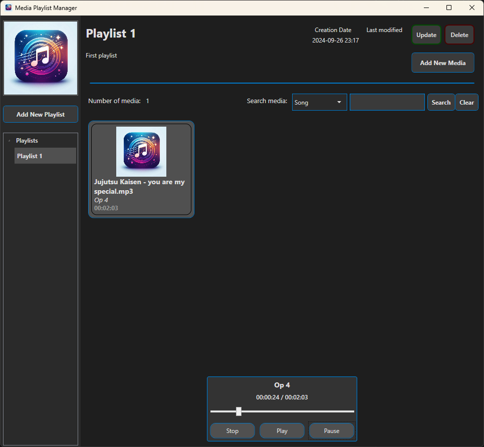
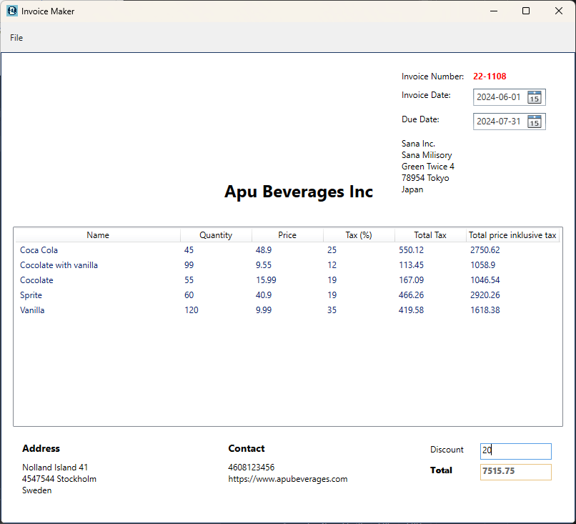
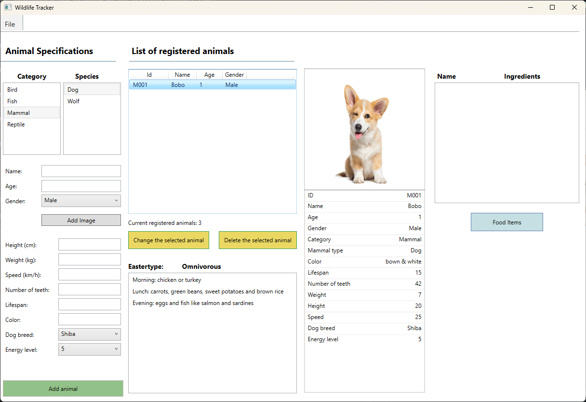

# Programming with C#

This repository contains simple programs implemented in C#. The projects are currently under development.

## Media Playlist Manager

A WPF application utilizing .NET 8, the MVVM architectural pattern, Entity Framework Core, LINQ, Microsoft SQL Server, and a 4-layer architecture (Presentation Layer **(PL)**, Business Logic Layer **(BLL)**, Data Access Layer **(DAL)**, and Data Transfer Object Layer **(DTO)**). The application is used to manage, organize, and customize playlists of different media types, including songs, audiobooks, and podcasts. The application has the following features:

-   User can create, update, and delete playlists. Each playlist consists of media items.
-   User can add, update and remove media items from a playlist.
-   User can play, pause, and stop a media item.
-   User can adjust media playback time, including fast-forwarding and rewinding media items.
-   User can search for media in a playlist by media type, title, or name.

## Airport App

This WPF application, utilizing .NET 8, is a simple simulation system for flight departures in an airport. The airport has a control tower where a controller can manage flight operations. The flight time is measured in seconds, and once the flight time ends, the airplane will land, and its status will change from "in-flight" to "landed". The Airport App features:

-   **Register Airplane**: A controller can register a plane to get ready on the runway and take off.
-   **Manage Flights**: The controller can select an airplane from the list and update its destination and flight time.

## Invoice Maker

This WPF application, utilizing .NET 8 and the MVVM architectural pattern, presents a template for invoices, with input data imported from a text file. The application calculates the total amount, including tax for each item. The user can enter a discount, and the application will calculate the new price, which will be displayed in the application.

## Wildlife Tracker system

This Windows Presentation Foundation (WPF) application, utilizing .NET 8, is suitable for use by animal parks or zoos. This application is designed with features for effectively registering and administering a diverse range of animal inhabitants. The following are the animal categories and species that can be administered:

1. **Bird**: dove and eagle
2. **Mammal**: wolf and dog
3. **Fish**: shark and goldfish
4. **Reptile**: frog and snake

The user can register an animal, save animal data to text and JSON files, and read from these files. Additionally, the user can delete an animal or update its information. The user can also add, delete, and modify food items and view the feeding schedule.

## Register Seller

This console application, utilizing the .NET Framework, reads data for a specified number of sellers in Salesforce. The user is prompted to enter the number of sellers to register, along with each seller's name, personnumber, district of work, and the number of items sold during the relevant period. Subsequently, the data is written to a file that the program can later read. The sellers are classified into four levels based on the number of items they have sold during the specified period.

-   level 1: under 50 items
-   level 2: 50-99 items
-   level 3: 100-199 items
-   level 4: over 199 items

## Person Registration

This Windows Forms application, utilizing the .NET Framework, is designed for registering individuals. The user inputs the person's first name, last name, and personnumber. A validator checks the entered data to ensure that the person is not already registered. If the data passes validation, the person is successfully registered. Registered individuals are displayed on the form under the **_Registrerade personer_** section. The person's data is also saved to a file, which the program can later read.

